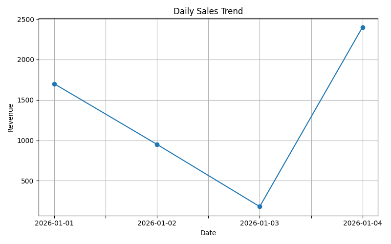
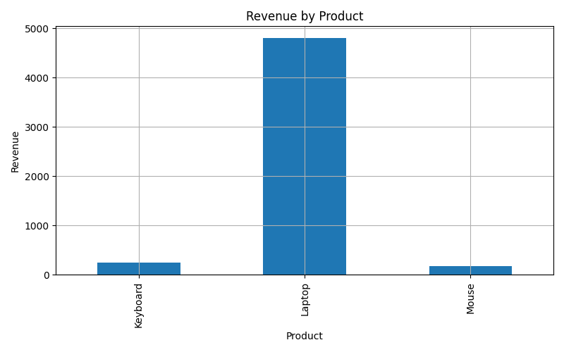
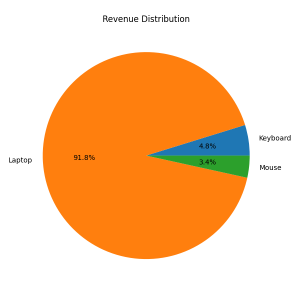

# 📊 Sales Data Analysis Project

## Overview

This project analyzes sales data using Python to extract insights such as revenue trends, product performance, and sales distribution.

## Tools Used

* Python
* Pandas
* Matplotlib

## Key Insights

* Total revenue calculated from transactional data
* Laptop identified as the top-performing product
* Sales trend shows fluctuation with peak on the final day

## 📊 Visualizations

### Daily Sales Trend

### Product Revenue

### Revenue Distribution

## Author

Saud Khan — Thinking Beyond the Universe
